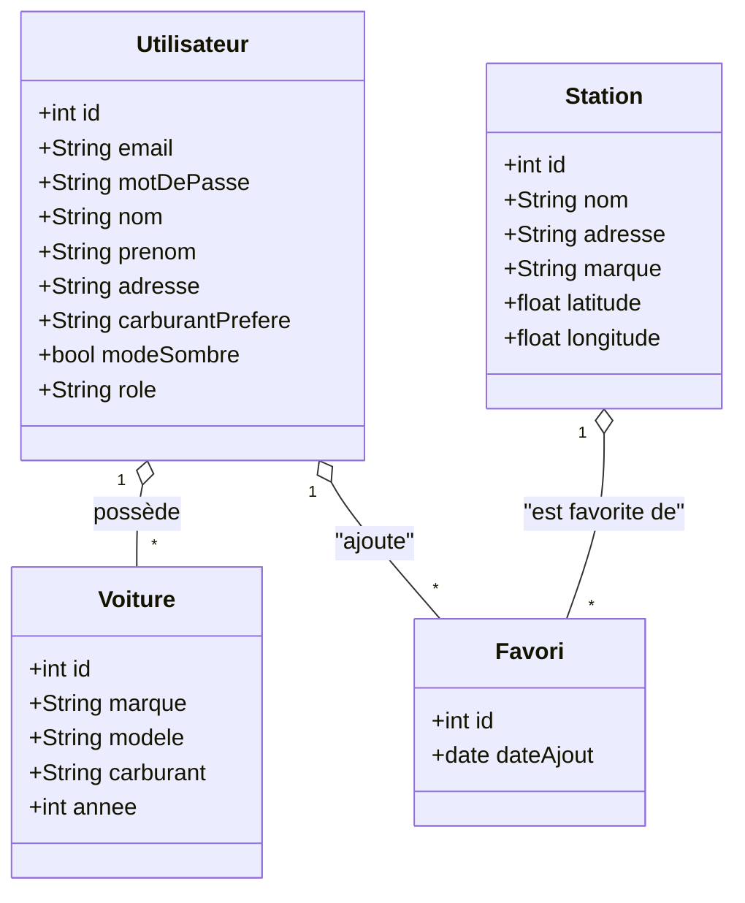

## UML class

```mermaid
classDiagram

class Utilisateur {
  +int id
  +String email
  +String motDePasse
  +String nom
  +String prenom
  +String adresse
  +String carburantPrefere
  +bool modeSombre
  +String role
}

class Voiture {
  +int id
  +String marque
  +String modele
  +String carburant
  +int annee
}

class Station {
  +int id
  +String nom
  +String adresse
  +String marque
  +float latitude
  +float longitude
}

class Favori {
  +int id
  +date dateAjout
}

Utilisateur "1" o-- "*" Voiture : possède
Utilisateur "1" o-- "*" Favori : "ajoute"
Station "1" o-- "*" Favori : "est favorite de"


```