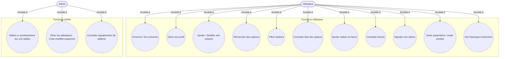

## UML cas d'utilisation

```mermaid
flowchart TD
  Utilisateur([Utilisateur])
  Admin([Admin])

  subgraph Fonctions Utilisateur
    UC1((S'inscrire / Se connecter))
    UC2((Gérer son profil))
    UC3((Ajouter / Modifier ses voitures))
    UC4((Rechercher des stations))
    UC5((Filtrer stations))
    UC6((Consulter liste des stations))
    UC7((Ajouter station en favori))
    UC8((Consulter favoris))
    UC9((Signaler une station))
    UC11((Gérer paramètres / mode sombre))
    UC12((Voir historique recherches))
  end

  subgraph Fonctions Admin
    AC2((Mettre un avertissement sur une station))
    AC3((Gérer les utilisateurs - Créer,modifier,supprimer))
    AC4((Consulter signalements de stations))
  end

  Utilisateur -- Accède à --> UC1
  Utilisateur -- Accède à --> UC2
  Utilisateur -- Accède à --> UC3
  Utilisateur -- Accède à --> UC4
  Utilisateur -- Accède à --> UC5
  Utilisateur -- Accède à --> UC6
  Utilisateur -- Accède à --> UC7
  Utilisateur -- Accède à --> UC8
  Utilisateur -- Accède à --> UC9
  Utilisateur -- Accède à --> UC11
  Utilisateur -- Accède à --> UC12

  Admin -- Accède à --> AC2
  Admin -- Accède à --> AC3
  Admin -- Accède à --> AC4


```