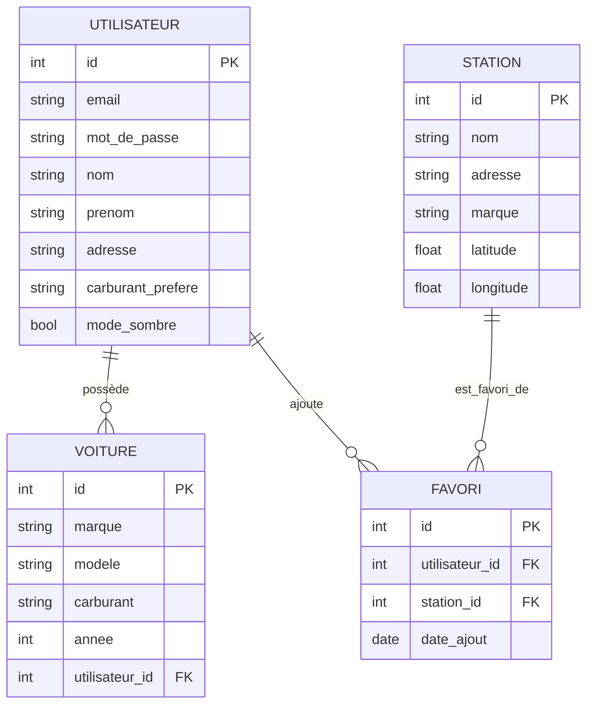

## MCD CarburApp

```mermaid
erDiagram
    UTILISATEUR {
        int id PK
        string email
        string mot_de_passe
        string nom
        string prenom
        string adresse
        string carburant_prefere
        bool mode_sombre
    }
    VOITURE {
        int id PK
        string marque
        string modele
        string carburant
        int annee
        int utilisateur_id FK
    }
    STATION {
        int id PK
        string nom
        string adresse
        string marque
        float latitude
        float longitude
    }
    FAVORI {
        int id PK
        int utilisateur_id FK
        int station_id FK
        date date_ajout
    }

    UTILISATEUR ||--o{ VOITURE : "possède"
    UTILISATEUR ||--o{ FAVORI : "ajoute"
    STATION ||--o{ FAVORI : "est_favori_de"


```