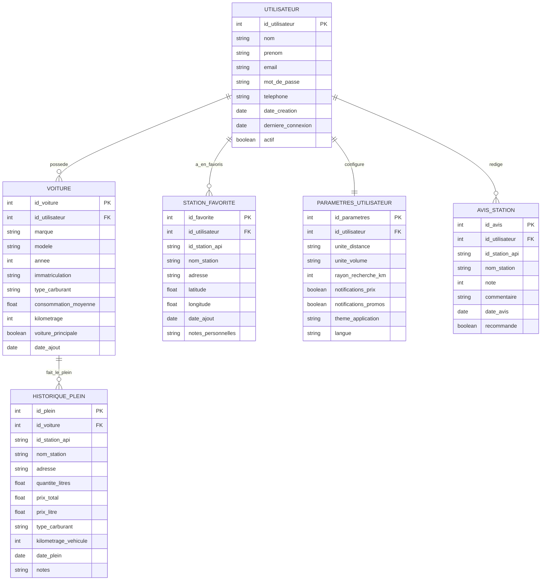

## MCD CarburApp

```mermaid
erDiagram
    UTILISATEUR {
        int id_utilisateur PK
        string nom
        string prenom
        string email
        string mot_de_passe
        string telephone
        date date_creation
        date derniere_connexion
        boolean actif
    }
    
    VOITURE {
        int id_voiture PK
        int id_utilisateur FK
        string marque
        string modele
        int annee
        string immatriculation
        string type_carburant
        float consommation_moyenne
        int kilometrage
        boolean voiture_principale
        date date_ajout
    }
    
    STATION_FAVORITE {
        int id_favorite PK
        int id_utilisateur FK
        string id_station_api
        string nom_station
        string adresse
        float latitude
        float longitude
        date date_ajout
        string notes_personnelles
    }
    
    PARAMETRES_UTILISATEUR {
        int id_parametres PK
        int id_utilisateur FK
        string unite_distance
        string unite_volume
        int rayon_recherche_km
        boolean notifications_prix
        boolean notifications_promos
        string theme_application
        string langue
    }
    
    HISTORIQUE_PLEIN {
        int id_plein PK
        int id_voiture FK
        string id_station_api
        string nom_station
        string adresse
        float quantite_litres
        float prix_total
        float prix_litre
        string type_carburant
        int kilometrage_vehicule
        date date_plein
        string notes
    }
    
    AVIS_STATION {
        int id_avis PK
        int id_utilisateur FK
        string id_station_api
        string nom_station
        int note
        string commentaire
        date date_avis
        boolean recommande
    }

    %% Relations
    UTILISATEUR ||--o{ VOITURE : possede
    UTILISATEUR ||--o{ STATION_FAVORITE : a_en_favoris
    UTILISATEUR ||--|| PARAMETRES_UTILISATEUR : configure
    UTILISATEUR ||--o{ AVIS_STATION : redige
    
    VOITURE ||--o{ HISTORIQUE_PLEIN : fait_le_plein


```